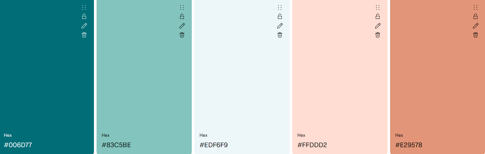

<!--  Write Readme explaing about the app. -->
<!-- Picture of application -->
<!-- Overview - See detailed section below -->
<!-- Using application  -->
<!-- UX -->
<!-- Features -->
<!-- Exitings functionality -->
Thie application is a simple app that helps the user keep track of exercise progress and plots data points on a chart
Ability to add new workouts
Overview of all current workouts 
<!-- Future Enhancements - See detailed section below -->
<!-- Testing -->
Playwright was used for E2E testing.
Chart check that buttons on chart remove the aproperate plotted line.


<!-- Use of AI - See detailed section below -->
<!-- Known Issues - See detailed section below -->
<!-- Deployment -->

<!-- Technologies Used - See detailed section below -->

<!-- Color Choice -->

<!-- Content -->
The data set was given by a 3rd party.
<!--  -->

# Fitness Tracker


A modern fitness tracking web application built with React, TypeScript, and Tailwind CSS.

## 📋 Overview

**Transform your fitness journey with data-driven insights.** This modern fitness tracker combines simplicity with powerful analytics to help you stay motivated and reach your goals.

### 🎯 What Makes This Special

| 💪 **Smart Tracking** | 📊 **Visual Analytics** | 🚀 **User Experience** |
|----------------------|-------------------------|------------------------|
| Intuitive workout logging with detailed exercise data | Interactive charts powered by Highcharts for clear progress visualization | Clean, responsive design that works seamlessly across all devices |
| Pre-loaded dataset for immediate exploration | Real-time data visualization with customizable chart views | Lightning-fast performance with modern React architecture |

### ✨ Perfect For
- **Fitness Enthusiasts** looking to visualize their progress
- **Data Lovers** who want insights into their workout patterns  
- **Goal-Oriented Athletes** tracking performance metrics
- **Anyone** starting their fitness journey with data-driven motivation

## 🚀 Live Demo

[View Live Application](https://fitness-tracker-bice-one.vercel.app/)

## Features

- **Add Workouts**: Easy-to-use form to log your exercise sessions
- **View Statistics**: Comprehensive overview of your fitness progress 
- **Interactive Charts**: Visual representation of your workout data using Highcharts
- **Responsive Design**: Optimized for both desktop and mobile devices
- **Performance Optimized**: Lazy loading and code splitting for fast load times

## 🛠️ Technologies Used

- **Frontend Framework**: React 19 with TypeScript
- **Styling**: Tailwind CSS for responsive design
- **Data Visualization**: Highcharts for interactive charts and graphs
- **Build Tool**: Vite for fast development and optimized builds
- **Testing Framework**: Playwright for comprehensive E2E testing
- **Deployment Platform**: Vercel for seamless CI/CD
- **Development Tools**: ESLint for code quality and consistency

## 🤖 Use of AI

This project leveraged AI assistance in several key areas:

- **Chart Implementation**: AI was used to assist with the implementation and configuration of Highcharts for data visualization
- **UI/UX Design**: AI helped optimize the user interface design and improve the overall user experience
- **Testing Framework**: AI assisted with the implementation of Playwright testing framework, including reading documentation and setting up test cases
- **Code Optimization**: AI was used to improve CSS reusability and modern gradient design implementations

## Getting Started

1. **Navigate to the project directory**
   ```bash
   cd my-app
   ```

2. **Install dependencies**
   ```bash
   npm install
   ```

3. **Start development server**
   ```bash
   npm run dev
   ```

4. **Open in browser**
   Navigate to `http://localhost:5173`

## Available Scripts

- `npm run dev` - Start development server
- `npm run build` - Build for production
- `npm run lint` - Run ESLint
- `npm run preview` - Preview production build

## Project Structure

```
src/
├── components/          # React components
│   ├── addWorkoutForm.tsx
│   ├── chart.tsx
│   ├── header.tsx
│   └── statsOverview.tsx
├── hooks/              # Custom hooks
└── chartConfig.ts      # Chart configuration
```

## Testing

This project uses **Playwright** for end-to-end testing with comprehensive browser coverage.

### Test Coverage

The test suite includes:
- **Page Load Tests**: Verifies title and welcome text display correctly
- **Form Interaction Tests**: Tests workout form visibility toggle and submission
- **Chart Rendering Tests**: Ensures Highcharts component loads and displays data
- **Cross-browser Testing**: Tests run on Chrome, Firefox, and Safari

### Running Tests

**Basic test run:**
```bash
npx playwright test
```

**Interactive UI mode (recommended for development):**
```bash
npx playwright test --ui
```

**Run specific browser:**
```bash
npx playwright test --project=chromium
npx playwright test --project=firefox
npx playwright test --project=webkit
```

**Debug mode:**
```bash
npx playwright test --debug
```

### Test Reports

After running tests, view the HTML report:
```bash
npx playwright show-report
```

### Test Configuration

- Tests run in parallel for faster execution
- Automatic retries on CI environments
- Trace collection on test failures for debugging
- Cross-browser testing (Chrome, Firefox, Safari)

### Prerequisites for Testing

Make sure your development server is running on `http://localhost:5173` before running tests:
```bash
npm run dev
```


## ⚠️ Known Issues

Currently, there are no major known issues with the application. However, here are some areas that could be improved:

- **Data Persistence**: Workout data is currently stored locally and will be lost if browser data is cleared
- **Chart Responsiveness**: Some chart elements may not be fully optimized for very small mobile screens
- **Form Validation**: Basic form validation is implemented but could be enhanced with more comprehensive error handling
- **Browser Compatibility**: While the app works on modern browsers, some features may not be fully supported on older browser versions

If you encounter any issues not listed here, please feel free to report them.

## 🔮 Future Enhancements

### Data Management
- **Google Fitness API Integration**: Connect to Google Health API to automatically sync workout data from smartphones and smartwatches
- **Cloud Storage Integration**: Implement backend database to sync workouts across devices
- **Wearable Device Support**: Integration with popular fitness trackers and smartwatches for automatic data collection
- **Local Storage Optimization**: Enhanced local storage with better data structure and compression
- **Export Functionality**: Allow users to export workout data as CSV/JSON files
- **Import Workouts**: Support importing data from other fitness apps

### User Experience
- **User Authentication**: Account creation and login system
- **Workout Templates**: Pre-built workout routines for different fitness goals
- **Progress Photos**: Upload and track progress photos over time
- **Dark Mode**: Toggle between light and dark themes

### Analytics & Insights
- **Advanced Statistics**: Weekly/monthly progress reports and trends
- **Goal Setting**: Set and track fitness goals with progress indicators
- **Personal Records**: Track and celebrate new personal bests
- **Workout Streaks**: Gamification with streak tracking and achievements

### Performance Optimizations
- **Text Compression**: Implement compression for better performance
- **Service Worker**: Add offline functionality and caching
- **Image Optimization**: Lazy loading and compression for progress photos
- **Progressive Web App**: Full PWA support with install prompt

### Social Features
- **Workout Sharing**: Share workouts with friends and community
- **Challenges**: Participate in fitness challenges with other users
- **Social Feed**: Follow friends and see their workout updates

### Technical Improvements
- **TypeScript Strict Mode**: Enhanced type safety across the application
- **Unit Testing**: Comprehensive Jest/React Testing Library coverage
- **CI/CD Pipeline**: Automated testing and deployment
- **Error Boundary**: Better error handling and user feedback

---

## 🎨 Color Scheme



The application uses a carefully curated ocean-inspired color palette:

- **Caribbean Current** (`#006D77`) - Deep teal for primary elements
- **Tiffany Blue** (`#83C5BE`) - Light teal for secondary elements  
- **Alice Blue** (`#EDF6F9`) - Very light blue for backgrounds
- **Pale Dogwood** (`#FFDDD2`) - Light peach for soft accents
- **Atomic Tangerine** (`#E29578`) - Warm orange for highlights